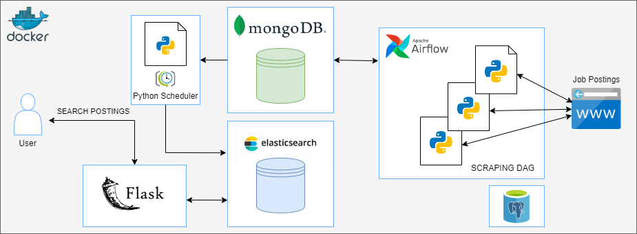

# JobPostingSearch
[](https://www.python.org/downloads/release/python-3910/)


**JobPostingSearch**는 IT 채용 공고 데이터를 활용하여 원하는 공고를 빠르게 찾을 수 있도록 통합적으로 검색할 수 있는 API를 구현하기 위해 데이터 파이프라인을 만든 프로젝트입니다.


<!-- TABLE OF CONTENTS -->
## Tables

* [Architecture diagram](#architecture-diagram)
* [How it works](#how-it-works)
    * [Data scraping](#data-scraping)
    * [Data flow](#data-flow)
    * [Data access](#data-access)
* [Prerequisites](#prerequisites)
* [Running project](#running-project)
* [API service](#api-service)
* [References](#references)

<!-- ARCHITECTURE DIAGRAM -->
## Architecture Diagram



<!-- HOW IT WORKS -->
## How it works

#### Data Scraping
각 **DAG**들은 IT 회사의 채용 공고를 스크래핑 후 **ETL**하는 DAG이다.
- task1 : 각 IT 회사 웹사이트의 채용 공고 게시물을 **Scraping**하여 파이썬 객체로 직렬화한다.
- task2 : task1의 데이터를 **Transform**한다.
- task3 : task2의 데이터를 **MongoDB**로 **Load**한다.

#### Data flow
- **Airflow DAG**를 통해 각 데이터가 **MongoDB**의 각 **collection**으로 저장된다.
- **Python**으로 작성한 스크립트로 **APScheduler**를 이용하여 만든 스케줄러가 **MongoDB**의 각 **collection documents**를 통합하여 **Elasticsearch**의 하나의 인덱스로 저장한다.

#### Data access
- 파이썬 웹 프레임워크 **Flask**로 접근할 수 있다.

<!-- PREREQUISITES -->
## Prerequisites
프로젝트를 실행시키기 위해 필요한 소프트웨어.

### Install:
- [Docker](https://docs.docker.com/get-docker/)
- [Python 3.9+ (pip)](https://www.python.org/)
- [docker-compose](https://docs.docker.com/compose/install/)


<!-- RUNNING PROJECT -->
## Running project
`manage.sh` 스크립트는 `docker-compose`를 작동시키기 위한 Shell 스크립트입니다.

- Build project infrastructure

```sh
./manage.sh start
```

- Stop project infrastructure

```sh
./manage.sh stop
```

- Down project infrastructure

```sh
./manage.sh down
```

<!-- API -->
## API service
- 모든 채용 공고
```
[GET] http://127.0.0.1:5000/postings
```

- 채용 공고 검색
```
[GET] http://127.0.0.1:5000/postings?search=keyword
```

<!-- REFERENCES -->
## References
* [UI/UX](https://github.com/startbootstrap/startbootstrap-sb-admin)
